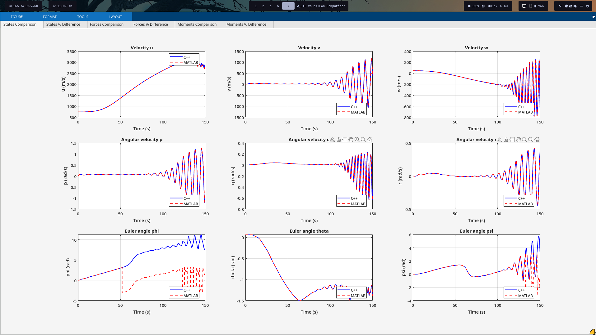
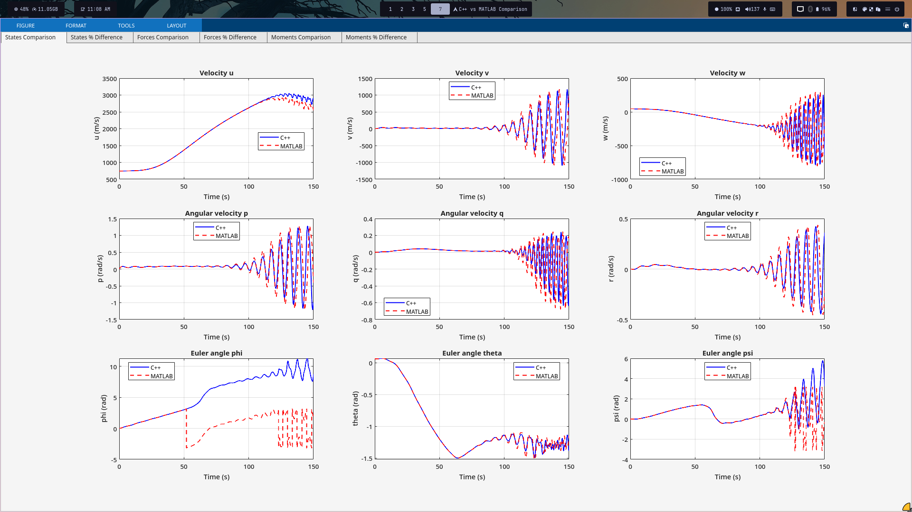

# Flight Simulator Software, Developed in C++
as a continuation to the AER4420 Course in my Final year of aerospace engineering atCcairo University>
during the course i was tasked to create an autopilot system for the Lockheed Martin's C5A Aircraft using Matlab/Simulink, this is C++ implementation for the same linearized aircraft dynamics around a certain flight condition with the same controllers.

> [!WARNING]
> this model does not approximate the continous time system like matlab would, notice the dynamics change with different time steps.

#### **Small 1ms Timesteps C++ vs Matlab**



---

#### **Bigger  10ms Timesteps C++ vs Matlab**



## AI DISCLAIMER
> [!IMPORTANT]
> Ai was used in this project to do the logging and the handling of files, it was also used in developing the rk4 solver and linking it to the Rigid Body Dynamics equations.
> this is a learning project, i'm trying to enhance my C++ skills so there's no point of prompting the ai to do it for me.


## Installing on Linux
*Dependencies:*
- [XLSX I/O C library](https://github.com/brechtsanders/xlsxio).
- C++ Eigen, most likely preinstalled in your distro, can be downloaded and put in the project directory, but you'll have to do some manual renaming in the header files.

*Compiling*
```bash
g++ flightsim.cpp -o FlightSimulator -I/usr/include/eigen3 -lm -lxlsxio_read
```
## Controller Implementation Choice
- This is a pseudo-Continuous Time project, using same controllers from the S domain like this:
if a state is to be derived (multiplied by s), for the fisrt time step we set the state_derivative = sum of non derivated states, next time step you get the state by doing state += state_derivative * dt
- ~~Most Likely the Servos will not be implemented for now~~ Nevermind I actually Implemented it in 20 minutes or so

## TODO 
- [ ] Deploy controllers to an stm32 based embedded board.
- [ ] Attach a rendering GUI for the Simulator.
- [ ] Makefile, maybe publish to AUR?